# T1 - Testare unitară in Python

Este implementată o clasă `EventManager` care gestionează evenimente, prin care putem adăuga, verifica conflicte și extrage evenimente dintr-un anumit interval.

Testele sunt scrise folosind `pytest` [1] și acoperă:

* Partiționare în clase de echivalență
* Analiza valorilor de frontieră
* Acoperire la nivel de instrucțiune, decizie, condiție
* Mutation testing cu `mutmut` [2]
* Raport AI

---

## Structura

```
- EventManager.py        # clasa testată
- test_event_manager.py  # teste unitare
- test_event_manager_chatgpt_detailed_prompt.py # teste unitare AI folosind un prompt detaliat
- test_event_manager_chatgpt_simple_prompt.py # teste unitare AI folosind un prompt simplu
- README.md              # documentație
```

## Clasa testată: `EventManager`

### Metode:

* `add_event(event_name: str, start_datetime: datetime, end_datetime: datetime) -> bool`
* `get_events_in_range(range_start: datetime, range_end: datetime) -> List`
* `has_conflict(start_datetime: datetime, end_datetime: datetime) -> bool`
* `get_event(event_name: str, detailed: bool) -> Union[Dict, bool]`

### Funcționalitățile clasei:

---
#### ADD EVENT


```python  
def add_event(self, event_name: str, start_datetime: datetime, end_datetime: datetime) -> bool:
``` 

Metoda _add_event_ returnează o valoare bool și primește trei parametri:

* _event_name_: numele evenimentului ce se cere a fi adăugat
* _start_datetime_: data și ora de start a evenimentului
* _end_datetime_: data și ora de finalizare a evenimentului

Toți parametri sunt validați în funcție de tipul de date cerut. În plus, _event_name_ trebuie să nu fie gol, iar _start_datetime_ trebuie să nu fie după _end_datetime_, dar nici înaintea timpului prezent.

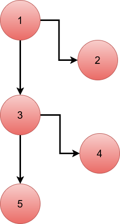

---

#### GET EVENTS IN RANGE
```python  
def get_events_in_range(self, range_start: datetime, range_end: datetime) -> List:
``` 
Metoda _get_events_in_range_ returnează o listă și primește doi parametri:

* _range_start_: data de start a intervalului pentru care sunt căutate evenimente
* _range_end_: data de sfârșit a intervalului pentru care sunt căutate evenimente

Toți parametri sunt validați în funcție de tipul de date cerut. Timpul de start trebuie să fie înaintea timpului de sfârșit. Dacă timpul de start a unui eveniment este după punctul minim al intervalului, iar timpul de finalizare a evenimentului este înaintea punctului maxim al intervalului, evenimentul este adăugat în lista finală.


---

### HAS CONFLICT
```python  
def has_conflict(self, start_datetime: datetime, end_datetime: datetime) -> bool:
``` 
Metoda _get_events_in_range_ returnează o valoare bool și primește doi parametri:

* _start_datetime_: data de start a intervalului pentru care sunt căutate evenimente
* _end_datetime_: data de sfârșit a intervalului pentru care sunt căutate evenimente

Toți parametri sunt validați în funcție de tipul de date cerut. Timpul de start trebuie să fie înaintea timpului de sfârșit. Dacă timpul de start a unui eveniment este după punctul minim al intervalului, iar timpul de finalizare a evenimentului este înaintea punctului maxim al intervalului, se returnează True, adică există conflict.

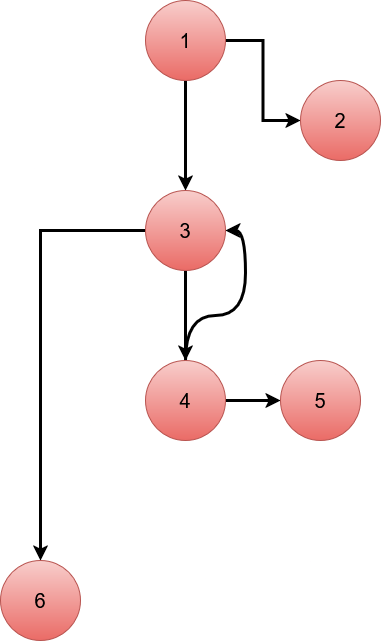

---


### GET EVENT
```python  
def get_event(self, event_name: str, detailed: bool) -> Union[Dict, bool]:
``` 
Metoda _get_event_ returnează fie o valoare bool, fie un eveniment detaliat, și primește doi parametri:

* _event_name_: numele evenimentului care este căutat
* _detailed_: în cazul în care se dorește evenimentul detaliat, _detailed_ este adevărat, în caz contrar, are valoarea False.

Toți parametri sunt validați în funcție de tipul de date cerut. Se iterează prin toate evenimentele salvate. În cazul în care este găsit un eveniment cu numele cerut, se verifică valoarea parametrului _detailed_. Dacă este True, este returnat evenimnetul alături de data de data și ora. Dacă este False, este returnat doar True. Dacă evenimentul nu este găsit, se returnează False.

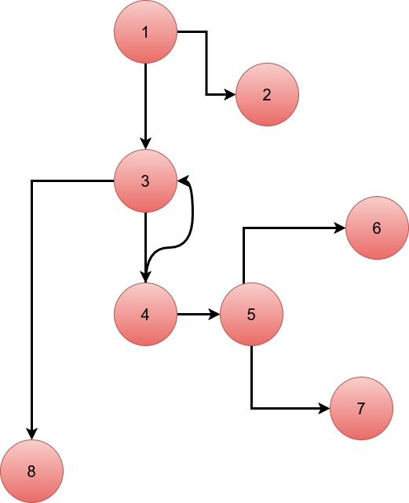

---

# Strategii de testare aplicate

## Testare funcțională

### 1. Partiționare în clase de echivalență 

Exemplificăm partiționarea în clase de echivalență cu ajutorul metodei _add_event_.

Domeniul de intrări:

* _event_name_ - un șir de caractere **nevid**
* _start_datetime_ - obiect de tip _datetime_, din **viitor**
* _end_datetime_ - obiect de tip _datetime_, este necesar să fie după _start_datetime_

Sunt analizate următoarele clase de echivalență:

_event_name_:

* N_1 = șir de caractere valid (nevid)
* N_2 = șir de caractere vid
* N_3 = tip de date invalid (int, None etc.)

_start_datetime_:

* S_1 = datetime valid, în viitor
* S_2 = datetime în trecut
* S_3 = tip de date invalid (str, int etc.)

_end_datetime_:

* E_1 = datetime valid, după start
* E_2 = datetime invalid, înainte de start
* E_3 = tip de date invalid (str, int etc.)


Domeniul de ieșiri:

* C_1 = True (evenimentul este adăugat)
* C_2 = False (parametri sunt invalizi)

Ilustrare test:

```python

@pytest.mark.parametrize("event_name, start_datetime, end_datetime, expected", [
        ("Meeting", datetime.now() + timedelta(days=1), datetime.now() + timedelta(days=2), True),  # valid N_1, S_1, E_1 -> C_1
        ("", datetime.now() + timedelta(days=1), datetime.now() + timedelta(days=2), False),  # event name empty N_2 -> C_2
        (None, datetime.now() + timedelta(days=1), datetime.now() + timedelta(days=2), False),  # event name not str N_3 -> C_2
        ("Test", "2024-01-01", datetime.now() + timedelta(days=2), False),  # start not datetime S_3 -> C_2
        ("Test", datetime.now() + timedelta(days=2), datetime.now() + timedelta(days=1), False),  # end before start E_2 -> C_2
        ("Test", datetime.now() - timedelta(days=1), datetime.now() + timedelta(days=1), False),  # start before present S_2 -> C_2
        ("Test", datetime.now() + timedelta(days=1), "2024-01-01", False), # end not datetime E_3 -> C_2
    ], ids=[
        "valid_event",
        "event_name_is_empty",
        "event_name_not_string",
        "start_not_datetime",
        "end_before_start",
        "start_before_nowtime",
        "end_not_datetime"
    ])
    def test_add_event_equivalence(self, event_name, start_datetime, end_datetime, expected, event_manager_empty):
        assert event_manager_empty.add_event(event_name, start_datetime, end_datetime) == expected
```

### 2. Analiza valorilor de frontieră

Ilustrăm analiza valorilor de frontieră cu ajutorul metodei _get_events_in_range_.

Lista evenimente conține un eveniment care începe la ora 10 și se termină la ora 12. Valorile de frontieră testate pot fi analizate în următorul tabel:

| Test                   | Descriere                                               | _range_start_              | _range_end_               | Rezultat |
| ------------------------ | ------------------------------------------------------- |----------------------------|---------------------------|----------|
| `equal_start_end_invalid` | start == end                                            | 2080-06-12 10:00           | 2080-06-12 10:00          | 0        |
| `start_after_end_invalid` | start > end                                             | 2080-06-12 12:00           | 2080-06-12 11:59          | 0        |
| `end_equals_event_start` | range se termină fix la începutul evenimentului         | 2080-06-12 08:00           | 2080-06-12 10:00          | 0        |
| `start_equals_event_end` | range începe fix când se termină evenimentul            | 2080-06-12 12:00           | 2080-06-12 13:00          | 0        |
| `exact_match`            | range = \[start, end] al evenimentului exact            | 2080-06-12 10:00           | 2080-06-12 12:00          | 1        |
| `inside_event`           | interval complet în interiorul evenimentului            | 2080-06-12 10:00:00.000001 | 2080-06-12 10:00:00.000002 | 1        |
| `partial_overlap_before` | începe înainte de eveniment și se termină la început    | 2080-06-12 09:59:59.999999 | 2080-06-12 10:00:00.000001 | 1        |
| `partial_overlap_after`  | începe înainte de finalul evenimentului, terminare după | 2080-06-12 11:59:59.999999 | 2080-06-12 12:00:00.000001 | 1        |

```python
@pytest.fixture
def event_manager_one_event():
    em = EventManager()
    em.add_event("event1", datetime(2080, 6, 12, 10), datetime(2080, 6, 12, 12))
    return em

@pytest.mark.parametrize("range_start, range_end, expected", [
        (datetime(2080, 6, 12, 10), datetime(2080, 6, 12, 10), 0), # invalid range_start == range_end
        (datetime(2080, 6, 12, 12, 0), datetime(2080, 6, 12, 11, 59), 0), # invalid start > end 1 minute diff
        (datetime(2080, 6, 12, 8, 0), datetime(2080, 6, 12, 10, 0), 0), # range end == event start no overlap
        (datetime(2080, 6, 12, 12, 0), datetime(2080, 6, 12, 13, 0), 0), # range start == event end no overlap
        (datetime(2080, 6, 12, 10, 0), datetime(2080, 6, 12, 12, 0), 1), #  range start end match event start end overlap
        (datetime(2080, 6, 12, 10, 0, 0, 1), datetime(2080, 6, 12, 10, 0, 0, 2), 1), # during event overlap start_range 1 microsec after event start
        (datetime(2080, 6, 12, 9, 59, 59, 999999), datetime(2080, 6, 12, 10, 0, 0, 1), 1), # partial overlap before
        (datetime(2080, 6, 12, 11, 59, 59, 999999), datetime(2080, 6, 12, 12, 0, 0, 1), 1),  # partial overlap after
    ], ids=[
        "equal_start_end_invalid",
        "start_after_end_invalid",
        "end_equals_event_start",
        "start_equals_event_end",
        "exact_match",
        "inside_event",
        "partial_overlap_before",
        "partial_overlap_after"
    ])
    def test_get_events_in_range_boundary(self, range_start, range_end, expected, event_manager_one_event):
        result = event_manager_one_event.get_events_in_range(range_start, range_end)
        assert len(result) == expected
```


---

## Testare structurală

Pentru a exemplifica testarea stucturală, utilizăm metoda _get_event_.

Testele scrise oferă acoperire 100% la nivel de condiții, decizii și instrucțiuni.

```python

    # event_name nu e str, asa ca tot if-ul devine True
    def test_invalid_name_type(self, event_manager_one_event):
        result = event_manager_one_event.get_event(123, True)
        assert result is False

    # detailed nu e bool, asa ca tot if-ul devine True
    def test_invalid_detailed_type(self, event_manager_one_event):
        result = event_manager_one_event.get_event("event1", "yes")
        assert result is False

    # evenimentul nu exisa, tot for-ul este executat
    def test_event_not_found(self, event_manager_one_event):
        result = event_manager_one_event.get_event("missing", False)
        assert result is False

    # eveniment gasit, detailed e false asa ca return True
    def test_event_found_brief(self, event_manager_one_event):
        result = event_manager_one_event.get_event("event1", False)
        assert result is True

    # eveniment gasit, detailed e True asa ca return event
    def test_event_found_detailed(self, event_manager_one_event):
        result = event_manager_one_event.get_event("event1", True)
        assert isinstance(result, dict)
        assert result["name"] == "event1"
```

**RAPORT COVERAGE**

A fost utilizat `coverage` [3] pentru testarea acoperirii.

```
coverage run -m pytest
coverage html
```

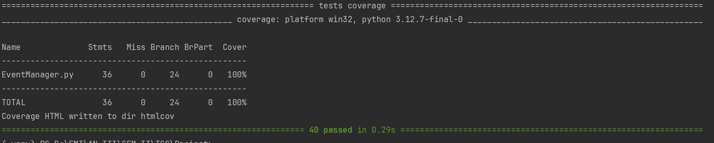

---

## Instalare dependențe

```
pip install pytest mutmut coverage
```
---

## Rulare teste

```
pytest
```

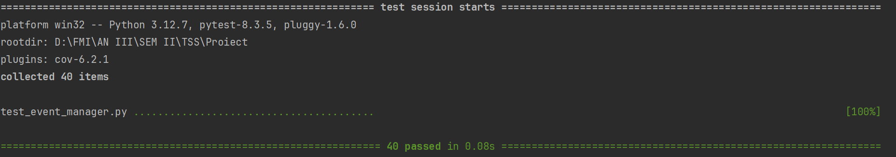

---

---
## Mutation Testing
Tool: `mutmut`

Pentru a folosi `mutmut`, în caz că utilizăm `Windows` ca sistem de operare, trebuie să folosim `WSL` cu `Ubuntu` instalat.

### Comandă rulare:

```
mutmut run
```

### Rezultat:
```
⠹ Generating mutants
    done in 1ms
⠦ Listing all tests
⠙ Running clean tests
    done
⠹ Running forced fail test
    done
Running mutation testing
⠧ 44/44  🎉 44 🫥 0  ⏰ 0  🤔 0  🙁 0  🔇 0
0.00 mutations/second

```

Poate fi observat că au fost creați 44 de mutanți, iar testele au acoperit toți mutanții. 

Prin _mutation testing_, codul clasei originale „suferă” mici modificări. În continuare, analizăm unul dintre mutanții creați pentru metoda _get_event_:

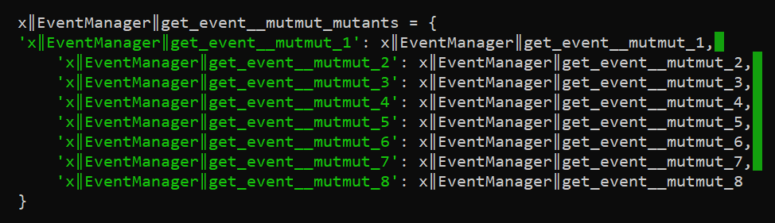

Putem observa că au fost creați opt mutanți.

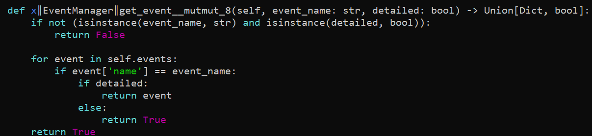

Ultimul return din metoda originală este `return False` deoarece nu a fost găsit niciun eveniment cu acel nume. În mutant, acea ultimă instrucțiune este transformată în `return True`, iar mutantul este „omorât” de testul:  

```python
    def test_event_not_found(self, event_manager_one_event):
        result = event_manager_one_event.get_event("missing", False)
        assert result is False
```
deoarece ne asigurăm că răspunsul este unul negativ, nu pozitiv, în cazul în care nu este găsit un eveniment.

---


## Raport AI

Pentru a analiza capacitățile inteligenței artificiale în creare de teste unitare, utilizăm două prompt-uri.

### 1. Prompt simplu

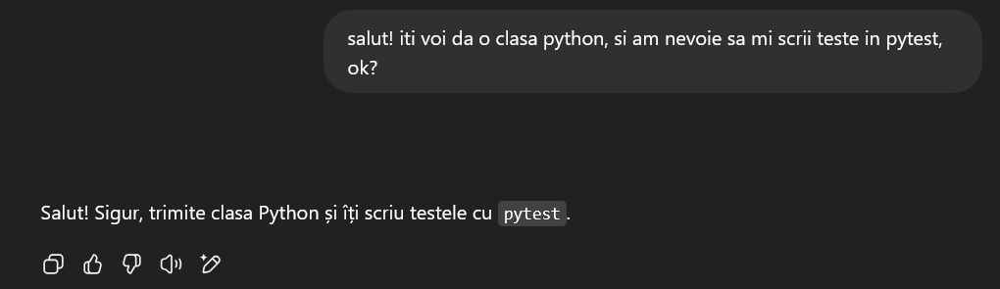

În cazul în care ChatGPT primește un prompt simplu da cel din imagine, acesta ne oferă 10 teste, care au un coverage de 90%. Ratează două instrucțiuni (_miss_) și acoperă numai parțial patru ramuri (_BrPart_).


---

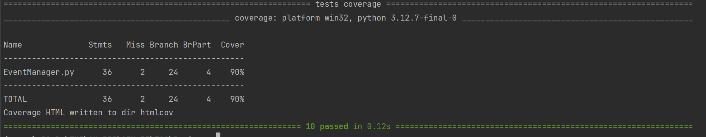

---

În cazul unui prompt detailiat cu cerința proiectului,  acesta ne ofera 16 teste, cu cu un coverage de 100%.

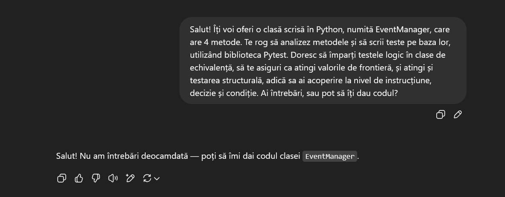

---

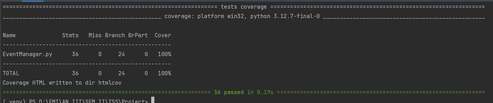

---

În ciuda acoperirii de 100% cu ajutorul prompt-ului detailiat, poate fi observat în fișierul  `test_event_manager_chatgpt_detailed_prompt.py` cum în cazul metodelor _has_conflict_ nu există acoperire completă la nivel de condiție (nu sunt testate de exemplu tipurile greșite pentru parametri datetime).

Metodele de testat nu sunt complicate, însă, în cazul unei metode mai complicate, putem extrapola că ChatGPT ar fi ratat anumite condiții mai importante. Condițiile de tip isinstance ar fi ajuns mai departe în cod să fi ridicat erori, astfel, tipul datelor trebuie testat.

Mai mult de atât, ChatGPT oferă o acoperire egală cu a noastră, printr-un număr mult mai mic de teste (16). Cu toate acestea, noi avem un număr ridicat de teste pentru scop didactic, pentru a avea acoperire completă la nivel de condiții și pentru a ilustra diferitele tipuri de testare în diferite cazuri. Desigur, tipul de testare utilizat poate fi ales în funcție de necesitățile clasei testate și de fluxul metodelor.

## Configurație _hardware_ și _software_

### 1. Configurație hardware

* CPU: Intel(R) Core(TM) i5-8250U CPU @ 1.60GHz
* RAM: 32,0 GB

### 2. Configurație software

* IDE: PyCharm Professional 2024.3
* Python 3.12.7

Pentru o listă detailiată a bibliotecilor utilizate, alături de versiuni, vezi `requirements_ubuntu.txt` și `requirements_windows.txt`.

### 3. Mașină virtuală

Pentru a utiliza `mutmut`, am utilizat WSL cu distribuția `Ubuntu`.

* Ubuntu 24.04.2 LTS
* mutmut 3.2.3

## Referințe

[1] Pytest, Documentație oficială, https://docs.pytest.org/en/7.0.x/, Data ultimei accesări: 14 mai 2025

[2] Mutmut, Documentație oficială, https://mutmut.readthedocs.io/en/latest/, Data ultimei accesări: 14 mai 2025

[3] Coverage, Documentație oficială, https://coverage.readthedocs.io/en/7.8.0/, Data ultimei accesări: 14 mai 2025

[4] Draw.io, Aplicație generare diagrame, https://app.diagrams.net/, Data ultimei accesări: 14 mai 2025

[5] OpenAI, ChatGPT, https://chatgpt.com/, Data generării: 14 mai 2025

---
