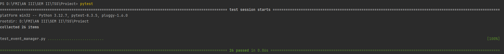
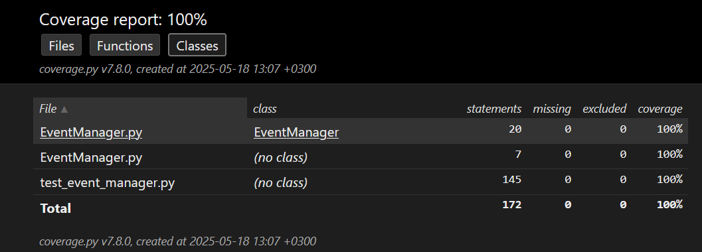
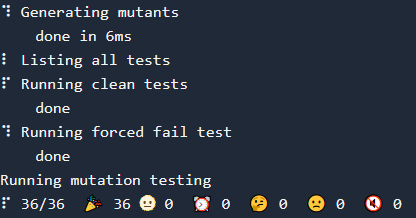
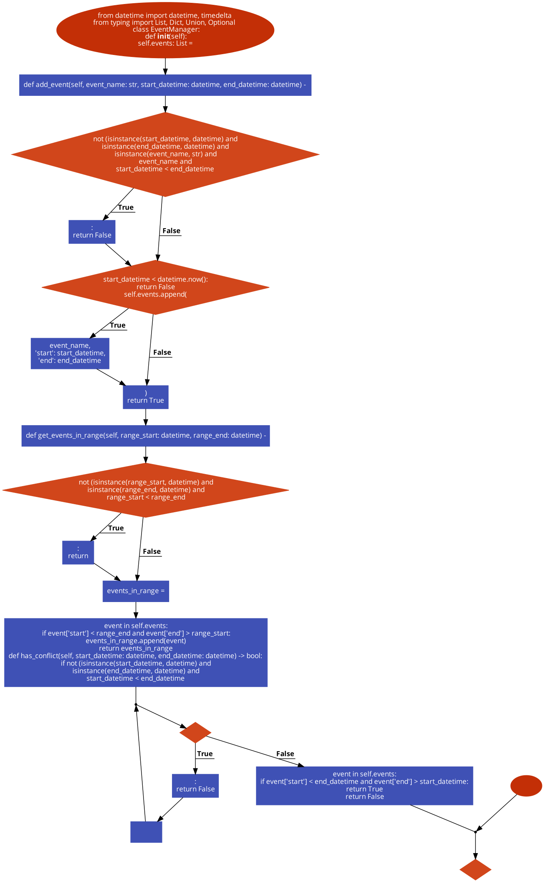

# T1 - Testare unitară in Python

Este implementată o clasă `EventManager` care gestionează evenimente, prin care putem adăuga, verifica conflicte și extrage evenimente dintr-un anumit interval.

Testele sunt scrise folosind `pytest` [1] și acoperă:

* Partiționare în clase de echivalență
* Analiza valorilor de frontieră
* Acoperire la nivel de instrucțiune, decizie, condiție
* Mutation testing cu `mutmut` [2]

---

## Structura

```
- EventManager.py        # clasa testată
- test_event_manager.py  # teste unitare
- README.md              # documentație
```

## Clasa testată: `EventManager`

### Metode:

* `add_event(event_name, start_datetime, end_datetime) -> bool`
* `get_events_in_range(range_start, range_end) -> List`
* `has_conflict(start_datetime, end_datetime) -> bool`

## Strategii de testare aplicate

### 1. Partiționare în clase de echivalență

* Valid/Invalid: tipuri greșite, date imposibile, string gol etc.

### 2. Analiza valorilor de frontieră

* Start == End
* Range exact la limita evenimentelor


Testele au ca scop atingerea tuturor ramurilor posibile de logică.

## Exemplu de testare

```python
def test_add_event_valid(event_manager_empty):
    event_to_add = {
        'name': 'name',
        'start': datetime.now() + timedelta(days=1),
        'end': datetime.now() + timedelta(days=2)
    }
    res = event_manager_empty.add_event(event_to_add['name'], event_to_add['start'], event_to_add['end'])

    assert res == True
```

---

## Instalare dependențe

```
pip install pytest mutmut coverage
```
---

## Rulare teste

```
pytest
```



---

## Testare acoperire cod

A fost utilizat `coverage` [3] pentru testarea acoperirii.

```
coverage run -m pytest
coverage html
```



---
## Mutation Testing
Tool: `mutmut`

Pentru a folosi `mutmut`, în caz că utilizăm `Windows` ca sistem de operare, trebuie să folosim `WSL` cu `Ubuntu` instalat.

### Comandă rulare:

```
mutmut run
```

### Rezultat:



---

---

## Diagramă clasă



A fost utilizat `code2flow` [4] pentru generarea diagramei.
---

## Asistență AI

A fost utilizat `ChatGPT` [5] pentru a oferi suport în construirea documentației.

---

## Referințe

[1] Pytest, Documentație oficială, https://docs.pytest.org/en/7.0.x/, Data ultimei accesări: 18 mai 2025

[2] Mutmut, Documentație oficială, https://mutmut.readthedocs.io/en/latest/, Data ultimei accesări: 18 mai 2025

[3] Coverage, Documentație oficială, https://coverage.readthedocs.io/en/7.8.0/, Data ultimei accesări: 18 mai 2025

[4] Code2Flow, Aplicație generare diagrame, https://app.code2flow.com/, Data ultimei accesări: 18 mai 2025

[5] OpenAI, ChatGPT, https://chatgpt.com/, Data generării: 18 mai 2025

---
